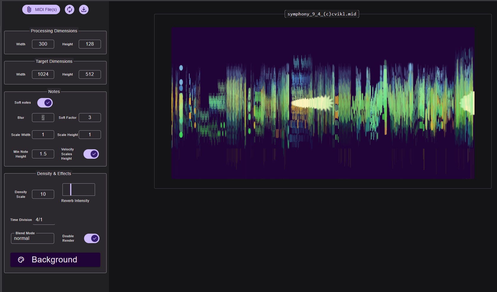
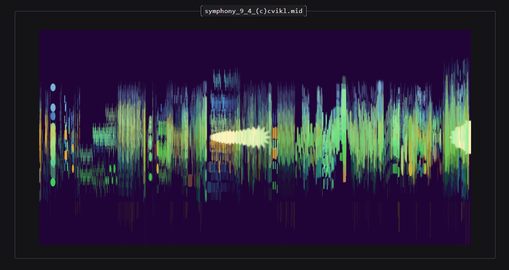
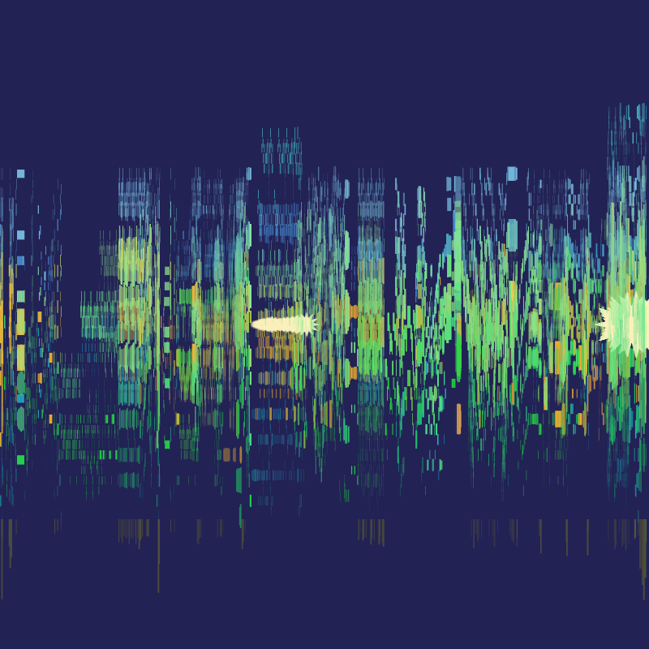

# SolidStart

### `[Client: SolidStart page/component]`
    - Upload MIDI(s)
    - Adjust controls: reverb, blur, soft notes, double layer, etc.
    - Generate preview SVG (fast, in browser)
    - Send parameters + MIDI to server for high-quality PNG

### `[Server route: /api/render]`
    - Receives MIDI(s) + render options
    - Uses Sharp / libvips to generate PNG
    - Returns PNG to client

 ## MIDI from https://www.kunstderfuge.com/beethoven/variae.htm#Symphonies :

 

 

 
